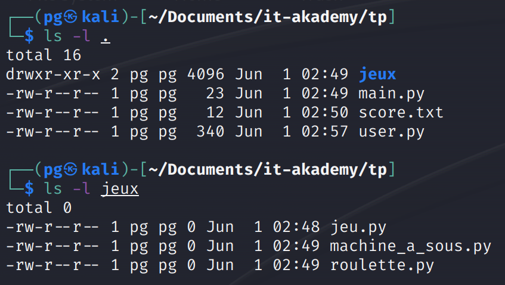

# TP - Mini Casino

Il s'agit d'un TP qui me permettra de valider le module **D33 - PGR - Initiation à la programmation réseau** de ma formation à l'**IT-Akademy**.

## Énoncé

> Le but de ce programme est de créer un mini casino avec 2 jeux : **une machine a sous** et **une roulette**.
> **Un tableau des scores est tenu dans un fichier score.txt**

## Structure attendu (Exemple)



### Étape 1 - (3pts)

-   [x] -   ~~Lors de début de la partie le tableau des scores est affiché.~~
-   [x] -   ~~Les scores sont enregistré dans le fichier score.txt.~~
-   [x] -   ~~La première ligne enregistre l'utilisateur qui a le plus d'argent.~~
-   [x] -   ~~La dernière celui qui en as le moins.~~
    -   (_Le cas d'égalité ne sera pas traité et laissé sur un ordre arbitraire_).
-   [x] -   ~~Une ligne est constituée du nom et de son argent, séparé par un ';'.~~

```sh
# Exemple de retour attendu
Gressier;999
Guillon;777
```

### Étape 2 - (3pts)

-   [x] -   ~~Un utilisateur est défini par son nom et son argent.~~
-   [x] -   ~~Il ne peut pas avoir moins de 0€.~~
-   [x] -   ~~Il doit être représenté par une classe dans un fichier a part.~~

### Étape 3 - (3pts)

-   [x] -   ~~Ensuite, l'utilisateur doit pouvoir entrer son nom.~~
-   [x] -   ~~Si son nom n'est pas dans le fichier score.txt, 100€ lui son donné.~~

### Étape 4 - (3pts)

-   [x] -   ~~Un menu lui est demandé s'il veut utiliser:~~
    -   [x] -   ~~la machine a sous. (choix 1)~~
    -   [x] -   ~~la roulette (choix 2)~~
    -   [x] -   ~~quitter (choix q).~~
    -   [x] -   ~~S'il entre une autre valeur, redemander.~~

### Étape 5 - (3pts)

-   [x] -   ~~S'il choisi quitter:~~
    -   [x] -   ~~afficher le tableau à jour~~
    -   [x] -   ~~sauvegarder le nouveau tableau dans le fichier score.txt (_pour une prochaine partie._)~~

### Étape 6 - (3pts)

-   [x] -   ~~Créer une classe jeu qui contient un attribut '**nom_du_jeu**'.~~
-   [x] -   ~~Cette attribué est initialisé par le constructeur.~~

```python
# Exemple de retour attendu
flechette = Jeu("Flechette")
```

-   [x] -   ~~Cette classe doit être dans le fichier 'jeu.py' lui même~~
-   [x] -   ~~dans le dossier 'jeux'~~
    -   [x] -   (~~_ainsi le chemin relatif est : **./jeux/jeu.py**_~~).
-   [x] -   ~~La classe Jeu possède une méthode "**bienvenue()**"~~ (_j'ai saisie afficher\_bienvenue()_)
-   [x] -   ~~Elle affiche "**Bienvenu dans [_nom du jeu_]**"~~

### Étape 7 - (3pts)

-   [x] -   ~~Créer une classe **MachineASous**~~
-   [x] -   ~~Elle hérite de **Jeu**.~~
-   [x] -   ~~**MachineASous** définie automatiquement le nom du jeu a "**Machine à sous**".~~
-   [x] -   ~~Si l'utilisateur a **choisi 1** au menu défini au point 4, le message de bienvenu est affiché (_via la méthode hérité de jeu_).~~
-   [x] -   ~~Le jeu est lancé via la méthode **run** (**machine_a_sous.run(user)**).~~
-   [x] -   ~~l'utilisateur peut choisir de jouer 1€ (**via la touche 1**) ou quitter (**via la touche q**).~~
-   [x] -   ~~En cas de mauvaise entrée, on redemande la saisie.~~
-   [x] -   ~~S'il quitte, l'utilisateur revient au menu défini au point 4.~~

### Étape 8 - (3pts)

-   [x] -   ~~Si 1€ est joué, il perd 1€.~~
-   [x] -   ~~La machine a sous tire au hasard alors 3 chiffres entre 1 et 6 compris.~~
-   [x] -   ~~Si les 3 chiffres sont identiques, il gagne 500€, sinon il ne gagne rien.~~
-   [x] -   ~~De nouveau il peut choisir entre jouer 1€ ou quitter~~

### Étape 9 - (3pts)

-   [x] -   ~~Créer une classe **Roulette**~~
-   [x] -   ~~Elle hérite de **Jeu**.~~
-   [x] -   ~~**Roulette** définie automatiquement le nom du jeu a "**Roulette**".~~
-   [x] -   ~~Si l'utilisateur a **choisi 2** au menu défini au point 4, le message de bienvenu est affiché (_via la méthode hérité de jeu_).~~
-   [x] -   ~~Le jeu est lancé via la méthode **run** (**roulette.run(user)**).~~
-   [] - L'utilisateur peut choisir de jouer une somme:
    -   [ ] -   Contrôle n°1: **doit être un nombre**
    -   [ ] -   Contrôle n°2: **doit être obligatoirement un nombre positif**
    -   [x] -   ~~Contrôle n°3: **doit posséder l'argent joué**~~
-   [x] -   ~~Enfin il peut quitter (**via touche q**).~~
-   [x] -   ~~En cas de mauvaise entrée, on redemande la saisie.~~
-   [x] -   ~~S'il quitte, l'utilisateur revient au menu défini au point 4.~~

### Étape 10 - (3pts)

-   [x] -   ~~Une fois la somme joué, il doit choisir un numéro entre 0 et 49 compris.~~
-   [x] -   ~~La roulette tire un numéro au hasard entre 0 et 49.~~
-   [x] -   ~~Le numéro tiré est celui choisi par l'utilisateur alors:~~
    -   [x] -   ~~il reçoit 3 fois la somme misée (**âpres l'avoir donnée a la roulette**).~~
-   [x] -   ~~le numéro choisi par l'utilisateur est paire **et que la roulette tire paire également** alors:~~
    -   [x] -   ~~Il récupère seulement 50% de sa somme initial. De même si le numéro de l'utilisateur est impaire et celui de la roulette est impaire.~~
-   [x] -   ~~Le numéro de l'utilisateur est paire **mais pas la roulette** (_ou inversement_) alors:~~
    -   [x] -   ~~l'utilisateur ne reçoit rien.~~
-   [x] -   ~~L'utilisateur peut de nouveau choisir:~~
    -   [x] -   ~~De rejouer une somme~~
    -   [x] -   ~~De quitter le jeu de la roulette.~~

---

### Étape 11 - BONUS - (3pts)

-   [ ] -   Ajouter un mot de passe a l'étape 2, via **getpass**
-   [ ] -   Stocker le mot de passe en **sha512** dans **score.txt**.
-   [ ] -   Si l'utilisateur existe mais le mdp n'est pas bon, c'est **la fin du programme avec une erreur custom**.
-   [ ] -   Si le mdp est bon **le programme continue**.
-   [ ] -   Si l'utilisateur n'existe pas **le programme continue** et **enregistre le sha du mdp pour le sauvegarder** a la fin (_classe User probablement à modifier_)

---

```diff
+ Vous avez le droit à l'aide de chatGPT et Google...
! Mais vous avez toutes les connaissances pour faire le programme.

+ Vous avez 1 semaine pour faire le programme.
! Soit fermeture/rendu le jeudi 08/06/2023 à 14:00.

! Le rendu doit être dans:
+ une archive ZIP
! au format
+ nom_prenom.zip
```

[^note]: This README File as write by Alain GUILLON.
[^other_note]: This TP as imagine by Paul GRESSIER
